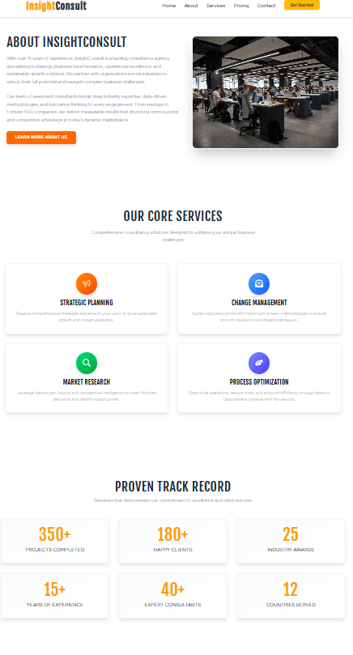
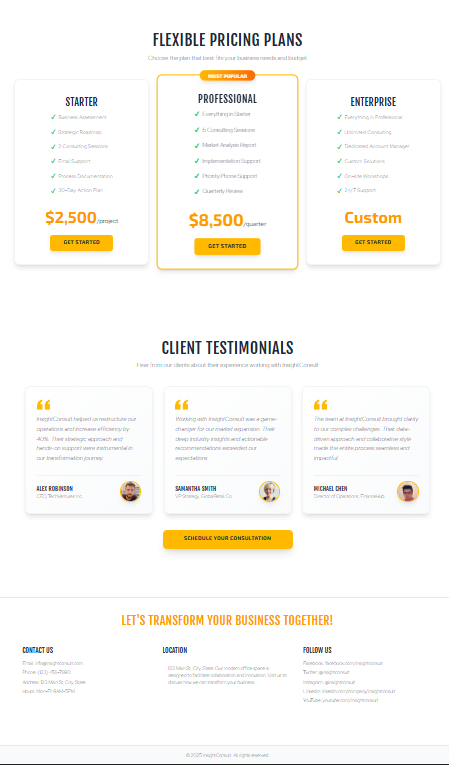

# InsightConsult - Professional Consultancy Website# InsightConsult - Professional Consultancy WebsiteThis is a [Next.js](https://nextjs.org) project bootstrapped with [`create-next-app`](https://github.com/vercel/next.js/tree/canary/packages/create-next-app).


A modern, fully responsive consultancy agency website built with Next.js 15, React 19, and Tailwind CSS 4.## Getting Started


A modern, fully responsive consultancy agency website built with Next.js 15, React 19, and Tailwind CSS 4.


---First, run the development server:


## 🚀 Features


### ✨ Core Functionality```bash

- **Smooth Scroll Navigation** - Enhanced with JavaScript, falls back to hash navigation

- **Responsive Design** - Mobile-first approach, works on all devicesnpm run dev

- **Dynamic Header** - Transparent on hero, white background when scrolled

- **Interactive Components** - Hover effects, transitions, and animations---# or

- **Section-based Layout** - Clean separation with proper spacing

- **Custom Typography** - Google Fonts integration (Fjalla One, Red Hat Display, Exo 2)yarn dev


### 🎯 Sections## 🚀 Features# or


1. **Hero/Banner** - Full-screen hero with background image and CTApnpm dev

2. **About** - Company overview with image and detailed description

3. **Services** - 4 core consultancy services with icons### ✨ Core Functionality# or

4. **Stats/Achievements** - 6 key metrics showcasing success

5. **Pricing** - 3-tier pricing plans (Starter, Professional, Enterprise)- **Smooth Scroll Navigation** - Enhanced with JavaScript, falls back to hash navigationbun dev

6. **Testimonials** - 3 client testimonials with photos

7. **Contact/Footer** - Contact info, map, and social links- **Responsive Design** - Mobile-first approach, works on all devices```


---- **Dynamic Header** - Transparent on hero, white background when scrolled


## 📸 Screenshots- **Interactive Components** - Hover effects, transitions, and animationsOpen [http://localhost:3000](http://localhost:3000) with your browser to see the result.


### Home Page - Hero Section- **Section-based Layout** - Clean separation with proper spacing


*Modern hero section with compelling headline and call-to-action*You can start editing the page by modifying `app/page.js`. The page auto-updates as you edit the file.


### Services & About Section### 🎯 Sections



*Showcase of core consultancy services with professional layout*1. **Hero/Banner** - Full-screen hero with background image and CTAThis project uses [`next/font`](https://nextjs.org/docs/app/building-your-application/optimizing/fonts) to automatically optimize and load [Geist](https://vercel.com/font), a new font family for Vercel.


### Pricing & Testimonials2. **About** - Company overview with image and detailed description



*Transparent pricing tiers and client testimonials*3. **Services** - 4 core consultancy services with icons## Learn More


---4. **Stats/Achievements** - 6 key metrics showcasing success


## 📋 Table of Contents5. **Pricing** - 3-tier pricing plans (Starter, Professional, Enterprise)To learn more about Next.js, take a look at the following resources:


- [Getting Started](#getting-started)6. **Testimonials** - 3 client testimonials with photos

- [Project Structure](#project-structure)

- [Key Components](#key-components)7. **Contact/Footer** - Contact info, map, and social links- [Next.js Documentation](https://nextjs.org/docs) - learn about Next.js features and API.

- [Navigation System](#navigation-system)

- [Styling & Design](#styling--design)- [Learn Next.js](https://nextjs.org/learn) - an interactive Next.js tutorial.

- [Content Overview](#content-overview)

- [Customization Guide](#customization-guide)---

- [Deployment](#deployment)

- [Technologies Used](#technologies-used)You can check out [the Next.js GitHub repository](https://github.com/vercel/next.js) - your feedback and contributions are welcome!


---## 📋 Table of Contents


## 🏃 Getting Started## Deploy on Vercel


### Prerequisites- [Getting Started](#getting-started)

- Node.js 18+ installed

- npm or yarn package manager- [Project Structure](#project-structure)The easiest way to deploy your Next.js app is to use the [Vercel Platform](https://vercel.com/new?utm_medium=default-template&filter=next.js&utm_source=create-next-app&utm_campaign=create-next-app-readme) from the creators of Next.js.


### Installation- [Key Components](#key-components)


1. **Clone or navigate to the project**:- [Navigation System](#navigation-system)Check out our [Next.js deployment documentation](https://nextjs.org/docs/app/building-your-application/deploying) for more details.

   ```bash

   cd "C:\Users\Prakshil\OneDrive\Desktop\project\nextjs UI\uiproject"- [Styling & Design](#styling--design)

   ```- [Content Overview](#content-overview)

- [Customization Guide](#customization-guide)

2. **Install dependencies** (if not already installed):- [Deployment](#deployment)

   ```bash- [Technologies Used](#technologies-used)

   npm install

   ```---


3. **Run the development server**:## 🏃 Getting Started

   ```bash

   npm run dev### Prerequisites

   ```- Node.js 18+ installed

- npm or yarn package manager

4. **Open in browser**:

   - Navigate to [http://localhost:3000](http://localhost:3000)### Installation

   - The app will hot-reload when you edit files

1. **Clone or navigate to the project**:

---   ```bash

   cd "C:\Users\Prakshil\OneDrive\Desktop\project\nextjs UI\uiproject"

## 📁 Project Structure   ```


```2. **Install dependencies** (if not already installed):

uiproject/   ```bash

├── src/   npm install

│   ├── app/   ```

│   │   ├── layout.js          # Root layout with fonts and global structure

│   │   ├── page.js            # Main page component3. **Run the development server**:

│   │   ├── globals.css        # Global styles and Tailwind config   ```bash

│   │   └── favicon.ico   npm run dev

│   └── components/   ```

│       ├── common/

│       │   ├── Header.jsx     # Navigation with scroll detection4. **Open your browser**:

│       │   └── Footer.jsx     # Footer with contact info   Navigate to [http://localhost:3000](http://localhost:3000)

│       ├── Banner/

│       │   └── Banner.jsx     # Hero section### Build for Production

│       ├── about/

│       │   └── About.jsx      # About section```bash

│       ├── Activities/npm run build

│       │   └── Activities.jsx # Services sectionnpm start

│       ├── Works/```

│       │   └── Works.jsx      # Stats/achievements

│       ├── Pricing/---

│       │   └── Pricing.jsx    # Pricing plans

│       └── Feedbacks/## 📁 Project Structure

│           └── Feedbacks.jsx  # Testimonials

├── public/```

│   ├── banner.jpg             # Hero background imageuiproject/

│   ├── 1.png                  # Screenshot 1 - Hero Section├── src/

│   ├── 2.png                  # Screenshot 2 - Services & About│   ├── app/

│   ├── 3.png                  # Screenshot 3 - Pricing & Testimonials│   │   ├── favicon.ico

│   └── [other assets]│   │   ├── globals.css          # Global styles & Tailwind imports

├── package.json│   │   ├── layout.js            # Root layout

├── next.config.mjs│   │   └── page.js              # Main page (all sections)

└── README.md│   └── components/

```│       ├── Banner/

│       │   └── Banner.jsx       # Hero section (#home)

---│       ├── about/

│       │   └── about.jsx        # About section (#about)

## 🔑 Key Components│       ├── Activities/

│       │   └── Activities.jsx   # Services section (#services)

### Header Component (`Header.jsx`)│       ├── Works/

**Features:**│       │   └── Works.jsx        # Stats/achievements

- Fixed position navigation│       ├── Pricing/

- Smooth scroll to sections with 80px offset│       │   └── Pricing.jsx      # Pricing plans (#pricing)

- Dynamic background (transparent → white on scroll)│       ├── Feedback/

- Responsive mobile menu ready│       │   └── Feedbacks.jsx    # Client testimonials

- Section links: Home, About, Services, Pricing, Contact│       └── common/

│           ├── Header.jsx       # Navigation header

**Key Code:**│           └── Footer.jsx       # Footer (#contact)

```javascript├── public/

const scrollToSection = (e, targetId) => {│   ├── banner.jpg               # Hero background image

  e.preventDefault();│   ├── about.jpg                # About section image

  const element = document.getElementById(targetId);│   └── ...

  if (element) {├── package.json

    const offsetPosition = element.offsetTop - 80;├── next.config.mjs

    window.scrollTo({└── README.md

      top: offsetPosition,```

      behavior: 'smooth'

    });---

  }

};## 🧩 Key Components

```

### 1. Header (`Header.jsx`)

### Banner Component (`Banner.jsx`)- **Fixed navigation** with smooth scroll

**Features:**- **Dynamic background**: Transparent → White on scroll

- Full viewport height hero section- **Dual navigation**: Hash links (default) + smooth scroll (enhanced)

- Background image with overlay- **Responsive**: Logo and full navigation menu

- Centered content with CTA button

- Responsive typography**Key Features**:

```javascript

**Customization:**// Scroll detection

- Change image: Replace `/public/banner.jpg`useEffect(() => {

- Edit text: Modify the headline and subheadline in the component  const handleScroll = () => {

- Adjust overlay: Change `bg-black/50` opacity value    setIsScrolled(window.scrollY > 100)

  }

### About Component (`About.jsx`)  window.addEventListener('scroll', handleScroll)

**Features:**})

- Two-column responsive layout

- Text left, image right on desktop// Smooth scroll with offset for fixed header

- Stacks vertically on mobileconst scrollToSection = (e, sectionId) => {

  e.preventDefault()

### Activities Component (`Activities.jsx`)  const element = document.getElementById(sectionId)

**Features:**  const offset = 80 // header height

- 2×2 grid of services  window.scrollTo({

- Icon integration with React Icons    top: element.offsetTop - offset,

- Gradient backgrounds on hover    behavior: 'smooth'

- Services:  })

  1. Brand Strategy (Megaphone icon)}

  2. Market Research (Magnifying Glass icon)```

  3. Digital Marketing (Envelope icon)

  4. Consulting Services (Hands icon)### 2. Banner (`Banner.jsx`)

- Full-screen hero with background image

### Pricing Component (`Pricing.jsx`)- Dark overlay for text readability

**Features:**- Responsive typography

- Three pricing tiers- Call-to-action button

- Middle tier highlighted

- Hover effects with scale transform### 3. About (`About.jsx`)

- Plans:- Two-column layout (7/12 text, 5/12 image)

  - **Starter**: $2,500/project- Consultancy-focused content

  - **Professional**: $8,500/month (Popular)- Professional imagery

  - **Enterprise**: Custom pricing- CTA button


### Feedbacks Component (`Feedbacks.jsx`)### 4. Services (`Activities.jsx`)

**Features:**- 4 service cards in 2x2 grid

- Three client testimonials- Icon badges with different colors

- Quote icons- Hover effects

- Circular profile images- Responsive grid layout

- Testimonials from:

  1. Sarah Johnson - Tech Innovations Inc.### 5. Pricing (`Pricing.jsx`)

  2. David Martinez - Global Retail Solutions- 3-tier pricing model

  3. Michael Chen - StartupHub Ventures- "Most Popular" badge on middle tier

- Feature lists

---- Professional pricing display


## 🧭 Navigation System### 6. Testimonials (`Feedbacks.jsx`)

- 3 client testimonial cards

### Dual Navigation Approach- Profile images with borders

- Quoted text format

1. **Hash-based Navigation** (Fallback):- Responsive card grid

   - Uses `href="#section-id"` for browser default

   - Works without JavaScript### 7. Footer (`Footer.jsx`)

   - Updates URL with hash- 3-column layout

- Contact information

2. **Smooth Scroll Navigation** (Enhanced):- Embedded Google Maps

   - JavaScript-powered smooth scrolling- Social media links

   - 80px offset for fixed header

   - Prevents default hash jump---


### Section IDs## 🧭 Navigation System

```javascript

// All sections have corresponding IDs### Dual Navigation Approach

#home      → Banner

#about     → AboutThe website uses a **hybrid navigation system** that works with and without JavaScript:

#services  → Activities

#pricing   → Pricing#### 1. Default Hash Navigation (No JS Required)

#contact   → Footer```html

```<a href="#about">About</a>

```

---- Works immediately, even if JavaScript is disabled

- Browser handles scrolling to the target element

## 🎨 Styling & Design- URL updates with hash (#about)


### Typography#### 2. Enhanced Smooth Scroll (With JS)

- **Headings**: Fjalla One (uppercase, bold)```javascript

- **Body Text**: Red Hat Display (clean, readable)onClick={(e) => scrollToSection(e, 'about')}

- **Accents**: Exo 2 (modern, dynamic)```

- Prevents default hash jump

### Color Scheme- Provides smooth scroll animation

- **Primary**: Blue gradient (`from-blue-600 to-blue-500`)- Accounts for fixed header offset (80px)

- **Accent**: Yellow (`yellow-400`)- Better user experience

- **Background**: White with subtle gray sections

- **Text**: Dark gray (`gray-800`, `gray-600`)### Section IDs

All major sections have IDs for navigation:

### Tailwind Configuration- `#home` → Banner

The project uses **Tailwind CSS 4.0** with the new `@import "tailwindcss"` syntax.- `#about` → About

- `#services` → Activities/Services

**Custom Classes** (in `globals.css`):- `#pricing` → Pricing

```css- `#contact` → Footer

.font-heading { font-family: var(--font-heading); }

.font-body { font-family: var(--font-body); }---

.font-accent { font-family: var(--font-accent); }

```## 🎨 Styling & Design


### Responsive Breakpoints### Color Palette

- **Mobile**: Default (< 768px)

- **Tablet**: `md:` (≥ 768px)```css

- **Desktop**: `lg:` (≥ 1024px)/* Primary Colors */

- **Large Desktop**: `xl:` (≥ 1280px)--amber-400: #fbbf24;  /* Primary CTA, accents */

--amber-500: #f59e0b;  /* Brand color, highlights */

---

/* Neutral Colors */

## 📝 Content Overview--gray-800: #1f2937;   /* Headings, dark text */

--gray-700: #374151;   /* Body text */

### Brand Identity--gray-600: #4b5563;   /* Secondary text */

- **Company Name**: InsightConsult--white: #ffffff;      /* Main backgrounds */

- **Tagline**: "Strategic Insights for Modern Businesses"

- **Value Proposition**: "We transform challenges into opportunities through data-driven insights and strategic consulting."/* Service Icons */

--orange-500: #f97316; /* Strategic Planning */

### Service Offerings--blue-500: #3b82f6;   /* Change Management */

1. **Brand Strategy** - Building powerful brands--green-500: #22c55e;  /* Market Research */

2. **Market Research** - Deep market understanding--indigo-500: #6366f1; /* Process Optimization */

3. **Digital Marketing** - Comprehensive campaigns```

4. **Consulting Services** - Expert business guidance

### Typography

### Key Metrics (Stats Section)- **Headings**: Bold, responsive (clamp or breakpoint-based sizing)

- 500+ Projects Completed- **Body**: Base size 16px, line-height relaxed

- 200+ Happy Clients- **Font Stack**: System fonts via Tailwind defaults

- 50+ Team Members

- 15+ Years Experience### Spacing System

- 98% Client Satisfaction- **Section Padding**: `py-20` (80px vertical)

- 24/7 Support Available- **Section Margin**: `mt-16` (64px top margin between sections)

- **Container**: `max-w-7xl mx-auto` (1280px max width, centered)

---- **Horizontal Padding**: `px-6` to `px-24` (responsive)

- **All sections**: White background for clean, unified look

## ⚙️ Customization Guide

### Responsive Breakpoints

### Changing Content```css

sm: 640px   /* Small devices */

#### 1. Update Company Informationmd: 768px   /* Medium devices */

**File**: `src/components/common/Header.jsx` and `Footer.jsx`lg: 1024px  /* Large devices */

```javascriptxl: 1280px  /* Extra large */

// Change company name2xl: 1536px /* 2X large */

<span className="font-heading text-2xl">YourCompanyName</span>```

```

---

#### 2. Modify Services

**File**: `src/components/Activities/Activities.jsx`## 📝 Content Overview

```javascript

const services = [### Company Profile

  {- **Name**: InsightConsult

    icon: <YourIcon />,- **Type**: Strategic Business Consultancy

    title: "Your Service",- **Tagline**: "Transform Your Business with Expert Consultancy"

    description: "Service description"- **Experience**: 15+ years in the industry

  },

  // Add more...### Core Services

];1. **Strategic Planning** - Develop comprehensive growth strategies

```2. **Change Management** - Guide organizational transformation

3. **Market Research & Analysis** - Data-driven insights

#### 3. Update Pricing4. **Process Optimization** - Streamline operations

**File**: `src/components/Pricing/Pricing.jsx`

```javascript### Key Statistics

<Pricing - 350+ Projects Completed

  title="Your Plan" - 180+ Happy Clients

  price="$X,XXX" - 25 Industry Awards

  features={["Feature 1", "Feature 2"]}- 15+ Years of Experience

/>- 40+ Expert Consultants

```- 12 Countries Served


#### 4. Edit Testimonials### Pricing Plans

**File**: `src/components/Feedbacks/Feedbacks.jsx`

- Update the testimonials array with new client feedback| Plan | Price | Best For |

|------|-------|----------|

### Changing Design| **Starter** | $2,500/project | Small projects, initial consultations |

| **Professional** | $8,500/quarter | Growing businesses, ongoing support |

#### Colors| **Enterprise** | Custom | Large organizations, full engagement |

**File**: `src/app/globals.css` or inline with Tailwind classes

```javascript### Testimonials

// Example: Change primary color from blue to purple- **Alex Robinson** - CEO, TechVentures Inc.

className="bg-gradient-to-r from-purple-600 to-purple-500"- **Samantha Smith** - VP Strategy, GlobalRetail Co.

```- **Michael Chen** - Director of Operations, FinanceHub


#### Fonts---

**File**: `src/app/layout.js`

- Update Google Fonts link## 🛠️ Customization Guide

- Modify CSS variables in `globals.css`

### Change Company Name

#### Layout**File**: `src/components/common/Header.jsx`

- Adjust Tailwind spacing classes (`py-20`, `px-6`, etc.)```jsx

- Modify grid layouts (`grid-cols-1 md:grid-cols-2`)<div className='text-2xl font-bold'>

  YourCompany<span className='text-gray-800'>Name</span>

---</div>

```

## 🚀 Deployment

### Update Hero Content

### Deploy to Vercel (Recommended)**File**: `src/components/Banner/Banner.jsx`

```jsx

1. **Push to GitHub**:<h1>Your Custom Headline</h1>

   ```bash<p>Your custom description</p>

   git init```

   git add .

   git commit -m "Initial commit"### Modify Services

   git remote add origin <your-repo-url>**File**: `src/components/Activities/Activities.jsx`

   git push -u origin main```jsx

   ```const services = [

  {

2. **Deploy on Vercel**:    icon: <YourIcon />,

   - Go to [vercel.com](https://vercel.com)    title: "Your Service",

   - Import your GitHub repository    description: "Service description"

   - Vercel will auto-detect Next.js and deploy  }

   - Your site will be live in minutes!]

```

### Alternative Deployment Options

- **Netlify**: Similar to Vercel, great for Next.js### Update Pricing

- **AWS Amplify**: For AWS ecosystem integration**File**: `src/components/Pricing/Pricing.jsx`

- **Self-hosted**: Use `npm run build` + `npm start` on your server```jsx

const plans = [

### Build Command  {

```bash    name: "Plan Name",

npm run build  # Creates optimized production build    price: "$XXX",

npm start      # Runs production server    period: "/month",

```    features: ["Feature 1", "Feature 2"]

  }

---]

```

## 🛠️ Technologies Used

### Change Colors

### Core Framework**File**: Update Tailwind classes throughout components

- **Next.js 15.5.5** - React framework with App Router```jsx

- **React 19.1.0** - UI library// From

- **Turbopack** - Ultra-fast bundler (Next.js default)className="bg-amber-400"


### Styling// To

- **Tailwind CSS 4.0** - Utility-first CSS frameworkclassName="bg-blue-500"

- **Google Fonts** - Custom typography (Fjalla One, Red Hat Display, Exo 2)```


### Icons & Assets### Replace Images

- **React Icons** - Icon library for services section1. Add your images to `/public` folder

- **Custom Images** - Banner and testimonial photos2. Update image paths:

   ```jsx

### Development Tools   // Banner

- **ESLint** - Code linting   style={{ backgroundImage: "url('/your-banner.jpg')" }}

- **PostCSS** - CSS processing   

   // About

---   

   ```

## 📞 Support & Contribution

### Update Contact Info

### Issues?**File**: `src/components/common/Footer.jsx`

If you encounter any issues:```jsx

1. Clear the `.next` folder and rebuild<p>Email: your-email@company.com</p>

2. Ensure Node.js 18+ is installed<p>Phone: (XXX) XXX-XXXX</p>

3. Check for port conflicts (default: 3000)```


### Customization Help---

- Tailwind Docs: [tailwindcss.com](https://tailwindcss.com)

- Next.js Docs: [nextjs.org/docs](https://nextjs.org/docs)## 🚀 Deployment

- React Icons: [react-icons.github.io](https://react-icons.github.io/react-icons)

### Deploy to Vercel (Recommended)

---

1. Push your code to GitHub

## 📄 License

2. Go to [vercel.com](https://vercel.com)

This project is open source and available for modification and personal/commercial use.

3. Click "New Project" → Import your repository

---

4. Vercel auto-detects Next.js:

## 🎉 Credits   - Build Command: `npm run build`

   - Output Directory: `.next`

Built with ❤️ using:   

- [Next.js](https://nextjs.org/) by Vercel5. Click "Deploy"

- [Tailwind CSS](https://tailwindcss.com/)

- [React Icons](https://react-icons.github.io/react-icons/)### Deploy to Netlify

- [Google Fonts](https://fonts.google.com/)

1. Build the project:

---   ```bash

   npm run build

**Happy Coding! 🚀**   ```


For questions or suggestions, feel free to reach out or open an issue in the repository.2. Install Netlify CLI:

   ```bash
   npm install -g netlify-cli
   ```

3. Deploy:
   ```bash
   netlify deploy --prod
   ```

### Other Platforms
- **AWS Amplify**: Connect GitHub repo
- **Railway**: Deploy via CLI or GitHub
- **Render**: Connect repo with auto-deploy

---

## 🔧 Technologies Used

### Frontend Framework
- **Next.js 15.5.5** - React framework with App Router
- **React 19.1.0** - UI library
- **React Icons** - Icon library (Ionicons, Font Awesome)

### Styling
- **Tailwind CSS 4.0** - Utility-first CSS framework
- **PostCSS** - CSS processing

### Development Tools
- **Turbopack** - Fast bundler (used in dev mode)
- **ESLint** - Code linting
- **JavaScript** - Main language

### APIs & Integrations
- **Google Maps Embed API** - Location map in footer
- **Random User API** - Demo profile images for testimonials

---

## 📦 Package.json Scripts

```json
{
  "scripts": {
    "dev": "next dev --turbopack",      // Start dev server
    "build": "next build --turbopack",  // Build for production
    "start": "next start",              // Start production server
    "lint": "eslint"                    // Run linter
  }
}
```

---

## 🐛 Troubleshooting

### Images Not Loading
- Ensure images are in the `/public` folder
- Use root-relative paths: `/banner.jpg` not `./banner.jpg`
- Check file names match (case-sensitive on some systems)

### Navigation Not Smooth
- Check that section IDs match href values
- Verify JavaScript is enabled
- Confirm no console errors

### Styling Issues
- Clear Next.js cache: `rm -rf .next`
- Rebuild: `npm run build`
- Check Tailwind config is correct

### Build Errors
- Run `npm install` to ensure all dependencies are installed
- Check for missing imports
- Verify all components are properly exported

---

## 📄 License

This project is for educational/portfolio purposes. Feel free to use and modify as needed.

---

## 👤 Author

**Prakshil**
- Project: Next.js UI Consultancy Website
- Date: 2025

---

## 🙏 Acknowledgments

- Next.js team for the amazing framework
- Tailwind CSS for the utility-first approach
- React Icons for the icon library
- Vercel for hosting platform

---

## 📞 Support

For questions or issues:
1. Check this README
2. Review the code comments
3. Check Next.js documentation: [nextjs.org/docs](https://nextjs.org/docs)
4. Check Tailwind docs: [tailwindcss.com/docs](https://tailwindcss.com/docs)

---

**Built with ❤️ using Next.js, React, and Tailwind CSS**
